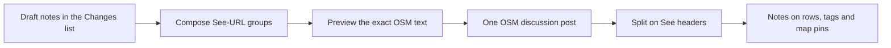
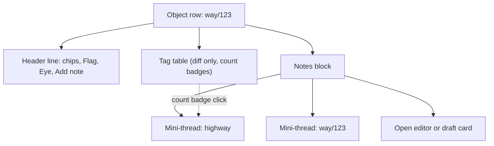
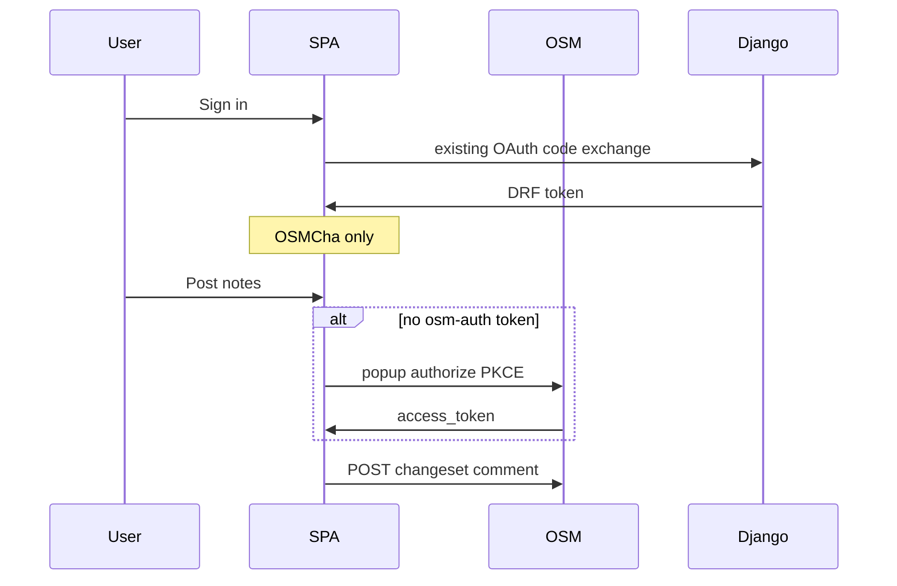

# Changeset notes via OSM deep links

## The problem and the one constraint

OSMCha has no database for per-object discussion. The only durable write available to us is an OSM **discussion post**, which cannot be edited or deleted after it is sent. v2 already reads that thread from OSM in [`src/network/openstreetmap.ts`](../../src/network/openstreetmap.ts), and today it is rendered as flat prose in [`discussions.tsx`](../../src/components/changeset/discussions.tsx).

So the design has to survive with a single append-only text field. The trick is that **a working OSMCha URL is the encoding**. Each note begins with a line containing that URL, which makes parsing a split on a marker rather than guesswork, and which leaves a link that mappers on osm.org can actually click.



Writes go to OSM directly from the SPA using osm-auth. Django is not touched in this plan.

## Domain language

Write this into [`CONTEXT.md`](../../CONTEXT.md) (new). The word "comment" is overloaded in this codebase and in OSM, so we stop using it on its own.

- **Changeset description** — the mapper's `comment=` tag on the changeset. Never call it a comment.
- **Discussion post** — one OSM changeset discussion body, authored by one person at one time. Never call it a comment on its own.
- **Note** — one in-app remark with a target. Many notes plus an optional intro compose into a single discussion post. Not an annotation, not a comment.
- **Note target** — the changeset (no `ref`), an object (`ref=way/123`), or a tag on an object (`ref=way/123/highway`). Each target may also carry a **pin**.
- **Reference** (`ref`) — the path that addresses an object or a tag. Not an element, focus, or feature.
- **Pin** — a map point attached to a note. Written `pin`, never `PIN`.

**Flag** (`reviewed_features`, see [`FlagFeatureButton.tsx`](../../src/components/changeset/FlagFeatureButton.tsx)) stays a separate OSMCha action. A note is not a flag, and posting notes does not set a verdict.

The geometry chips (Moved, Rewritten) are object-level concerns, so they take object notes. A tag row is a tag row whether the changeset mutated it or not: both a change row and an unchanged existing tag are addressed as `ref=type/id/key`, and the diff itself tells the reader which one it is.

## One `ref` parameter, not `element` plus `tag`

Splitting this into `element` and `tag` would be a bad fit, because a tag is not optional chrome hanging off an element — it is a narrower address of the same thing, and a `tag` without an `element` means nothing. One path keeps a single chrome key and reads the way OSM already reads.

| `ref`                 | Target                                                                      |
| --------------------- | --------------------------------------------------------------------------- |
| _(absent)_            | The changeset itself                                                        |
| `way/123`             | An object                                                                   |
| `way/123/highway`     | The tag key `highway` on that object                                        |
| `way/123/addr:street` | Everything after the second `/` is the key, so keys may contain `:` and `/` |

Emit and accept only this grammar. No aliases.

```
ref  = type "/" id [ "/" key ]
type = "node" | "way" | "relation"
id   = digits
key  = the rest of the value after the second "/"
```

`pin=lat,lng` rounded to five decimals (about one metre) is orthogonal to `ref`, which gives six valid combinations:

| Note                | `ref`             | `pin` |
| ------------------- | ----------------- | ----- |
| Changeset, no pin   | —                 | —     |
| Changeset, with pin | —                 | yes   |
| Object, no pin      | `way/123`         | —     |
| Object, with pin    | `way/123`         | yes   |
| Tag, no pin         | `way/123/highway` | —     |
| Tag, with pin       | `way/123/highway` | yes   |

A pin on an object note is not redundant with the object's own geometry: the object says _what_ we are discussing, the pin says _where the reviewer is pointing_ ("the crossing belongs here, not there").

The canonical posted URL uses a configured public origin rather than a hardcoded `osmcha.org`:

```
https://<NOTE_PUBLIC_ORIGIN>/changesets/123456789?ref=way/123/highway&pin=52.52014,13.40521
```

### Wiring the parameters

Add `ref` and `pin` to the schema in [`searchSchemas.ts`](../../src/routing/searchSchemas.ts) **and** to `searchParamsRegistry`, so [`filterSearch.ts`](../../src/routing/filterSearch.ts) treats them as chrome instead of mistaking them for changeset filters. Put the parse and serialize helpers in `src/routing/refParam.ts` and `src/routing/pinParam.ts`, following the shape of [`mapParam.ts`](../../src/routing/mapParam.ts) (Zod schema, `parse…` returning `null`, `serialize…`, unit test file alongside).

Both keys are per-changeset state, so they must be dropped when the user opens a different changeset. `mapParam.ts` already exports `searchWithoutMap` for exactly this, used by [`row.tsx`](../../src/components/list/row.tsx); generalise it to also strip `ref` and `pin`.

No change is needed in [`routerSearch.ts`](../../src/routing/routerSearch.ts): `makeSearchPretty` already un-escapes `%2F`, `%3A` and `%2C`, so `ref=way/123/addr:street` and `pin=52.52014,13.40521` survive the round trip and stay readable in the address bar.

The existing `map` parameter stays camera-only, and we deliberately **do not** put `map=` into a posted note URL — the recipient should get our framing of the object, not a snapshot of the author's viewport.

## What osm.org actually renders

Checked against the local `openstreetmap-website` clone on `master`, in sync with `origin/master`. Changeset discussion is **not** Markdown.

[`ChangesetComment#body`](https://github.com/openstreetmap/openstreetmap-website/blob/master/app/models/changeset_comment.rb) is a `RichText.new("text", …)`, and [`RichText::Text#to_html`](https://github.com/openstreetmap/openstreetmap-website/blob/master/lib/rich_text.rb) applies exactly four steps: HTML-escape, Rails `simple_format` (a blank line starts a new paragraph, a single newline becomes `<br>`), Rinku autolinking of `http(s)` URLs, then shorthand expansion so `way/123` links to the object, `highway=path` to the wiki, and `@user` to the profile.

Diary entries use Markdown; changeset comments do not. `**bold**` and `- lists` appear literally on osm.org. Emoji are fine — the body validator only rejects control characters, and the upstream tests include `🙂` — but emoji must never be the machine-readable token, because copy-paste can drop a variation selector.

`way/123` inside `?ref=way/123` is safe from shorthand expansion, since `=` is not a delimiter for those patterns.

### Length and rate limits

This corrects an earlier assumption in this plan. `ChangesetComment` validates only `:body, :characters => true, :presence => true` — **there is no length limit on a changeset discussion body**. The 2000-character cap belongs to `NoteComment#body`, a different model for map notes. The only hard character cap anywhere in our stack is the 1000 in the Django serializer, and that applies solely to the fallback path.

There _is_ a rate limit. [`Api::ChangesetCommentsController#create`](https://github.com/openstreetmap/openstreetmap-website/blob/master/app/controllers/api/changeset_comments_controller.rb) raises `OSM::APIRateLimitExceeded` when the user's comments in the last hour reach `max_changeset_comments_per_hour`, which `config/settings.yml` sets to **6 for a new account**, scaling to 60 after 200 comments.

Three consequences for the UI:

- **One post per review, always.** Splitting a long review across several posts would burn a new reviewer's entire hourly allowance on a single changeset. Since there is no length cap, there is no reason to split.
- No hard character gate. Above roughly 1500 characters, show a quiet advisory that this will be a long post on osm.org — not an error.
- A rate-limit rejection needs its own error state (see [Failure modes](#failure-modes)); it is likely for exactly the new accounts we most want to onboard.

## The post layout: split on `See <url>`

Every note group starts with a header line, then its body on the following lines. Parsing is therefore a split followed by an assignment, with no sniffing anywhere.

The query string exists for OSMCha. Nobody reading osm.org decodes `?ref=`, so the header also carries a short visible label between `See ` and the URL. The composer always writes that label; the parser never requires it.

```
Optional intro, changeset-level, no header. This is today's free-text discussion.

See `way/123` https://<NOTE_PUBLIC_ORIGIN>/changesets/999?ref=way/123
The classification looks wrong for this residential street.

See `way/123` > `highway` https://<NOTE_PUBLIC_ORIGIN>/changesets/999?ref=way/123/highway
This looks like a path, not residential.

See 📍 https://<NOTE_PUBLIC_ORIGIN>/changesets/999?pin=52.52014,13.40521
The crossing is missing here.

See 📍 `way/123` > `highway` https://<NOTE_PUBLIC_ORIGIN>/changesets/999?ref=way/123/highway&pin=52.52014,13.40521
Same tag, and a pin where I think the geometry should go.
```

The label is frozen: backticks around the object and the key, `>` for the hierarchy from object to tag, and 📍 first whenever a pin is present. There is no tag emoji, because the second backticked token already says "tag".

| Note              | Label                          |
| ----------------- | ------------------------------ |
| Object            | `` `way/123` ``                |
| Tag or change row | `` `way/123` > `highway` ``    |
| Pin only          | `📍`                           |
| Object with pin   | `` 📍 `way/123` ``             |
| Tag with pin      | `` 📍 `way/123` > `highway` `` |

Two details worth knowing: osm.org still autolinks `way/123` inside backticks, because a backtick counts as a delimiter for their shorthand, which is a happy accident. And `>` sits mid-line, so nothing downstream will read it as a blockquote.

`See ` stays the machine prefix rather than 📍 alone because it is stable ASCII at the start of a line, it reads correctly in a screen reader, and the emoji is decoration that copy-paste can mangle. `Re:` looks like email and `Reference:` is long.

The composer writes `See ` + label + space + canonical URL, then a newline, then the body, then a blank line before the next group. Anything before the first header is the intro.

### The label is decoration, and OSMCha ignores it

This is an important simplification. Because the target comes from the URL's query string, the visible label carries no information we need. So OSMCha **derives the chip it displays from `ref`** and drops the entire header line from the body it renders. A hand-edited or mismatched label is therefore harmless, and we never need a Markdown parser to read those backticks back.

Note bodies render as plain text with line breaks plus autolinked URLs, reusing the existing `LinkifyText` from [`discussions.tsx`](../../src/components/changeset/discussions.tsx). We do **not** build a Markdown-subset renderer and we do **not** offer a formatting toolbar, because anything we rendered as rich text would appear as raw punctuation to every reader on osm.org. One text pipeline, no mismatch.

### The reference footer

Do not reuse Django's footer (`#REVIEWED_GOOD` / `#REVIEWED_BAD`, `#OSMCHA`, "Published using OSMCha"). That footer asserts an evaluation; all we want is a way back to the changeset.

Since the SPA owns the body it posts, the rule is:

- If the post contains at least one group header, **omit the footer entirely** — those URLs already are the reference.
- Otherwise append exactly one line, with no review hashtags:

```
See https://<NOTE_PUBLIC_ORIGIN>/changesets/{id}
```

That line has neither `ref` nor `pin`, so our own parser will not mistake it for a note group (rule 5 below), and osm.org still autolinks it.

The Django fallback path still appends the old evaluation footer. That is one more reason to prefer completing the osm-auth flow.

## Parser: our schema only, and never crash

Do not try to interpret handwritten object references such as `n/123`, `way-123` or `w 123`. Those are not our schema, and guessing at them turns other people's prose into fake structure. Foreign text is ignored, not interpreted.

A line is a group header only if **all** of these hold:

1. It starts with `See ` at the beginning of a line.
2. The same line contains an `https://` URL, optionally preceded by a label.
3. The hostname is in the configured allowlist (below), not a hardcoded `osmcha.org`.
4. The path is `/changesets/{the changeset currently open}`.
5. The query contains `ref` and/or `pin`.

If rules 1 to 4 fail it is not a header and we keep scanning. Django's old footer, for instance, has no `See ` and no `ref`, so it is ignored.

If rules 1 to 4 hold but rule 5 fails — a `See` line pointing at this changeset with neither parameter, which is exactly our own reference footer — it is not a note group and nothing is attached.

If `ref` is present but does not match the grammar, skip that one group without throwing. The raw post still appears in the Discussion tab, so nothing is hidden from the reader.

Beyond that: unknown query keys are ignored so the schema can grow; a `ref` pointing at an object that is not in this augmented diff is still a valid note, because people legitimately point at neighbouring objects; several posts targeting the same thing stack by post date; and the author and timestamp always come from the OSM post, never from the text.

### Host allowlist, from config

The production hostname will not stay `osmcha.org`, so the composer and the parser share one config in [`constants.ts`](../../src/config/constants.ts):

- `NOTE_PUBLIC_ORIGIN` — the origin we emit in `See` URLs and in the footer. It must never be `localhost` in a body that could reach production OSM.
- `NOTE_LINK_HOSTS` — the hostnames we accept when parsing: current production, the `www.` variant, preview and staging, plus `localhost` and `127.0.0.1` for local round-trips. Compare the hostname only, case-insensitively.

A `See` URL on an unlisted host is not a header, and neither is one pointing at a different changeset id.

### Parser tests, required

Vitest beside the parser, following [`changesetElements.test.ts`](../../src/components/changeset/changesetElements.test.ts). Cover at least:

- The happy path: an intro plus object, tag, pin-only and tag-with-pin groups carrying the markdown labels; a key containing a colon; unknown extra query keys.
- Labels are optional: `See ` plus URL alone still parses, since a human may have stripped the emoji.
- The allowlist: a listed host parses, an unknown host is ignored, `www` only when listed.
- Things that are not headers: Django's evaluation footer; our own `See` reference footer; a `See` pointing at a different changeset; a URL that is not at the start of a line.
- An invalid `ref` skips its group without throwing while the rest of the post still parses.
- Garbage, empty input and text with no URLs return `[]` and never throw.
- Round trip: composing N notes and parsing the result yields the same targets and bodies; an intro-only post gets the footer and a grouped post does not.

Record the frozen schema as [`docs/adr/0001-notes-in-osm-discussion-urls.md`](../adr/0001-notes-in-osm-discussion-urls.md) (new directory).

## The review UI

This is the hard part, because the review column is narrow (320 to 640px, default 384, from `src/layout/paneWidths.ts`), already dense, and on small screens it is a bottom sheet sitting on top of the map. Everything below is written against what [`DetailsChanges.tsx`](../../src/components/changeset/DetailsChanges.tsx) and [`tag_rows.tsx`](../../src/components/tag_rows.tsx) actually render today.

### What the surface looks like today

The Changes list is a plain non-virtualised list, sectioned into Created, Modified and Deleted. Inside a section, `groupChangesByTagMutation` collapses objects that share identical tag changes into a `TagMutationGroup` disclosure. Three properties of that code drive the decisions below:

- An `ElementChangeRow` is an `<li>` with a header line of chips and buttons, and its tag table always visible underneath. Rows are not individually expandable.
- Tag rows are `<dt>`/`<dd>` pairs in a `<dl>` at `text-xs/4` with `py-1`, so a row is roughly 24px tall, while every interactive control in that header is `min-h-11` (44px) for touch.
- **A `TagMutationGroup` renders one shared tag table for all N objects, and the object rows inside it are rendered with `showTags={false}`.** For a grouped object there is literally no per-object tag row in the DOM.

That last point invalidates any design that hangs a thread or a button off "the tag row for way/123", which is why the rendering rule comes first.

### Rule: notes never render inside the tag table

Injecting a thread between `<dt>`/`<dd>` pairs would break the two-column grid, push the diff around while someone is reading it, and — for grouped objects — have nowhere to go at all.

Instead, every object row gets a **Notes block** below its tag table, and that is the only place discussion appears:

- Object-level notes first, then tag-level notes grouped by key, in the order those keys appear in the tag table above.
- Each mini-thread carries a header chip: `way/123` for an object note, or the bare key in the same mono styling as a `dt` for a tag note.
- Entries within a mini-thread are oldest first, each showing author, relative time, body, and a pin badge when the note has a pin.
- Drafts live in the same block.

The tag table gets exactly one addition: a tag row that has notes shows a small count badge at the end of its `<dd>`, and clicking it scrolls to and flashes the matching mini-thread below. That is one inline element, no layout change, and no extra height.

The payoff is that the diff table stays a diff table, discussion has one predictable home per object, and singleton rows and grouped rows behave identically.



### Adding a note

The object row header gains one control in the existing action cluster beside Flag, Eye and Open-in, where 44px targets already live so nothing needs resizing. Use a message icon from [`icons.ts`](../../src/components/ui/icons.ts), adding one if needed per `.cursor/rules/icons.mdc`.

Clicking **Add note** on an object that has tags opens a short menu: the object itself first, then one entry per key in that row's tag table. This is what makes tag notes reachable inside a `TagMutationGroup`, where no per-object tag row exists. On an untagged object it skips the menu and opens the editor directly.

For singleton rows there is also a shortcut: hovering a tag row reveals a small comment icon at the end of the row. It stays visually small so the 24px row height is untouched, but gets a 44px hit area from a pseudo-element (`after:absolute after:inset-x-0 after:-inset-y-2.5`) rather than from `min-h-11`. On touch, where `@media (hover: none)` applies, the icon is permanently visible. It is a real `<button>` in tab order and also appears on `focus-visible`, so keyboard users are not locked out of a hover-only affordance.

Either route opens the editor **in the Notes block**, never between tag rows, so the diff never shifts under the cursor while typing.

### The editor and drafts

The editor holds the target chip with a control to change or clear the target, a plain textarea, a Place pin control, and Save and Discard.

Several drafts can exist at once, but only one is open for editing. A saved draft stays visible in its Notes block as a draft card with Edit and Delete, which resolves an ambiguity in the earlier version of this plan: closing the editor never hides a draft.

Draft styling has to dodge a collision. Selection already owns `bg-yellow-50` on the row, so drafts cannot be "GitHub yellow" without reading as selected. Use a dashed left border, a white background and a `Draft` badge instead, and keep colour out of it.

A draft with a pin but no text is not postable. Require a non-empty trimmed body and say so inline, because a bare pin posts as an empty group that nobody can interpret.

Drafts and Seen state are persisted to `localStorage`, keyed by changeset id and OSM user, in a new store following the kebab-case `actions` convention of [`list-pane-store.ts`](../../src/stores/list-pane-store.ts). Losing twenty minutes of review notes to an accidental reload is not acceptable, and this is the only reason the store needs to exist. Parsed notes are not persisted; TanStack Query owns those.

Neither key may grow without bound. Drop unposted drafts after a few weeks, since a draft that old is noise, and evict Seen entries by least-recently-used changeset rather than by age — an old `seenAt` is still perfectly meaningful (see below).

### Seen collapses a row, it does not remove it

Each object row gets a Seen checkbox, meaning "I looked at this, it is fine, and it is not worth saying anything about". It is local only, never sent to OSM, and never a flag.

Seen **collapses the row to a single line** rather than removing it, and that line stays clickable so the row can always be reopened on the spot. It also keeps showing the note count and pin numbers if the row has any. Fully hiding the row was the earlier wording and it created two problems: a row could be hidden while carrying somebody else's published note, silently dropping discussion from the page, and a reviewer who collapsed something by mistake had no local way back to it. Collapsing preserves the invariant that **every parsed note is rendered exactly once somewhere in the UI**.

The list header shows how many rows are collapsed and expands them all again. Seen is object-level, not per key.

#### Seen expires when the discussion moves on

Persisting Seen across sessions is worth having — returning to a large changeset three days later should not mean walking every row again — but it is only safe if a new answer cannot stay hidden behind it. Somebody replying to a note on a row you had already ticked is precisely the case that must not be missed. So Seen is stored as a **timestamp, not a boolean**:

- The store keeps `seenAt` per `type/id`, per changeset, per user.
- A row renders collapsed only while its `seenAt` is **newer than every published note on that row**, comparing against the latest post date across its object-level and tag-level notes.
- As soon as somebody answers on a row you had marked seen, `seenAt` is older than that note, so the row expands by itself and carries a short "new since you marked this seen" marker.
- Ticking Seen again simply writes a fresh `seenAt`.

This is the same mechanic GitHub uses when it clears Viewed after a file changes, and it composes well with the five-minute discussion poll described in [`docs/caching.md`](../caching.md): a note arriving while the pane is open re-expands its row on the next render, with no extra bookkeeping.

Your own unposted drafts are excluded from the comparison — you already know about them, and a draft has no post date to compare against. Dates come from the OSM post's `date` field and are compared in UTC.

### Notes with no matching row

Some notes cannot attach: the object is not in this augmented diff, or it is an untagged way-member node that `shouldListAction` deliberately omits, or the key no longer exists on the object. These go into an **Other notes** section at the end of the Changes list, each showing its target as text with a link to osm.org.

This section is what keeps the invariant honest. A note that parsed but rendered nowhere would quietly destroy trust in the feature.

### Changeset-level notes and the list header

Changeset-level notes — intro prose and pin-only notes — go into an **On this changeset** block above the Created section. Unstructured posts with no groups at all also belong here, and stay out of the object rows entirely.

Three things want the top of a 384px column, so the header is one compact row: the total note count, the seen count as a control, and the pin legend reduced to colour swatches with counts. Author names live in the swatch tooltip, and the full legend with names goes into the map controls panel (hotkey `8`), where there is room for it.

### Pins

Placement needs an explicit, transient mode, which is a change from the earlier version of this plan. "Drop at map centre, then drag" is unusable on a phone, where the expanded review sheet covers 80% of the map, and it is imprecise even on a desktop.

So **Place pin** arms a placement mode: a banner reads "Tap the map to place this pin" with a Cancel, the map's click handler places the pin instead of doing its usual feature hit-test, and `Esc` cancels. On small screens, arming it also collapses the review sheet so the map is actually visible, then re-expands it with the editor open once the pin lands.

This has to interact deliberately with [`changesetMapClick.ts`](../../src/views/changesetMapClick.ts), which today runs a 5px hit test and rotates through overlapping features on repeated clicks. While placement is armed, that logic is suppressed entirely — otherwise a tap near a way would both select the way and place a pin.

Once placed, the pin is draggable for as long as its editor is open, and clicking a draft pin on the map reopens its editor. Removing the pin never removes the text. There is no persistent "comment mode" on the map: the mode is armed by one button and disarmed by the next click or `Esc`.

### Pin numbers are view-local

One sequence `1…n` covers every pin on the changeset: published pins first in post order — oldest post first, then the order of groups within that post — followed by your own draft pins. The same `#3` appears on the map marker and next to the note in the list. Clicking a marker scrolls to and highlights its note; clicking the number in the list zooms to the pin.

The numbers are assigned at render time and are not stored in the post, which has a consequence worth writing down: **a number means nothing outside the current view.** Two readers can see different numbers for the same pin, and every number shifts as soon as anybody posts. So note bodies must never say "see pin #3", and the composer must never emit a number into the text. The UI should label them as map references for this view, not as identifiers.

Colour identifies the author, not the pin. Assign palette entries **by order of first appearance in the thread**, not by hashing the username: with 8 to 10 colours a hash collides often enough that the legend would start lying about who is who. All of one author's pins share their colour while the numbers stay unique, and your own drafts use your colour with a hollow or dashed marker so unpublished pins are obvious.

Colour is never the only signal. The number is unique, and every note names its author in text, which is what makes this workable for colour-blind readers. Author colours appear only on markers and legend swatches — never as a row background, where they would collide with the diff's own blue, orange and yellow.

### One draft, two editing surfaces

There is exactly **one draft per changeset**, and that draft is the internal data model: a free-text part plus an ordered list of structured notes. Every piece of UI edits that same object, and nothing reaches OSM until it is posted.

The two tabs own different halves of it, which is what keeps a narrow column from carrying two competing composers:

- **Changes** is where structured notes are authored. Add note, the editors, pins and Seen all live here. There is no free-text field and no Post button on this tab.
- **Discussion** is where the draft is finished. It edits the free-text part, lists the structured notes read-only, shows the preview, and holds the only Post button.

So the call to action at the end of the Changes list is **Review and finish comment (3 notes)**, and it switches tabs rather than posting. The same label appears in a compact sticky bar at the bottom of the review column whenever the draft is non-empty, so nobody has to scroll to find it. On small screens that bar sits above the sheet's drag handle.

In the Discussion tab the pending draft is a card at the end of the thread, clearly distinct from published posts, containing:

- the free-text textarea, which is the old plain comment box from [`comment.tsx`](../../src/components/changeset/comment.tsx); the `message_good` and `message_bad` templates prefill here when a verdict is set,
- Place pin for that block, producing a changeset-level pin (a `pin` with no `ref`),
- the structured notes as a read-only list, each with its target chip and body. Clicking one switches to Changes and deep-links its `ref`, so a note has exactly one place where it can be edited or deleted and the two tabs can never disagree about its content,
- **Preview** of the exact plaintext that will be posted, in monospace: every `See` header, the free text, the conditional footer and a character count, with a Copy button so a failed post can still be pasted by hand,
- **Post to OSM**, labelled with the count, plus a line stating that discussion posts cannot be edited or deleted once sent.

Because Post exists only here, the preview is always on screen beside it. For this feature that is the safeguard that matters most, since there is no undo.

Switching tabs never discards the draft.

### Failure modes

Each of these keeps the drafts intact. Losing a composed review to an error is the worst outcome available to this feature.

- **osm-auth popup blocked or cancelled** — offer the Django fallback, and say plainly that it caps the body at 1000 characters and appends the old evaluation footer.
- **Rate limited (`429`)** — explain that OSM allows a limited number of discussion posts per hour, 6 for a new account rising to 60, and offer Copy so the text is not trapped. This is a likely path for new reviewers, not an edge case.
- **Network failure** — keep everything and offer Retry.
- **Success** — clear the drafts, invalidate the discussion query per [`docs/caching.md`](../caching.md), and the drafts reappear as published notes. Pins renumber, which is expected.

Somebody else posting while you draft cannot conflict, since we only ever append. The refetch after posting will simply shift the pin numbering.

### Signed out

Drafting is entirely local, so let people draft, mark rows Seen, and place pins while signed out, then gate only the Post action behind the existing Sign in button. Blocking the whole flow up front means a signed-out reviewer cannot even start, and Seen keys can fall back to an anonymous key.

## Deep link behaviour

Opening `/changesets/999?ref=way/123/highway&pin=52.52014,13.40521` has to do more than set state, because several parts of the current UI would otherwise swallow it:

1. Open the review column, and on small screens expand the bottom sheet, since [`ReviewColumn.tsx`](../../src/components/changeset/ReviewColumn.tsx) hides the tabs and body until it is expanded.
2. Force the Changes tab on. Tab state is local React state in [`Changeset.tsx`](../../src/components/changeset/Changeset.tsx) and `exclusiveKeyToggleState` allows **both** tabs to be off, so a deep link can currently land on an empty pane.
3. If the object sits inside a `TagMutationGroup`, open that disclosure. Its `defaultOpen` currently follows `containsSelected` only, and must follow `ref` too.
4. Scroll the row into view with `scrollIntoView({ block: 'nearest' })`. The Changes list has no scroll-to behaviour today — only the list pane rows do — so this is new.
5. Flash the row, and when a key is present highlight that `<dt>`/`<dd>` pair for a couple of seconds.
6. Select the feature on the map and zoom once, reusing the existing `zoomToAndSelect` path. Zoom happens **only on deep-link entry**; clicking a row inside the app keeps today's behaviour, where only the Eye button moves the camera.
7. Draw the pin if `pin` is present, and include it in the camera fit.
8. If nothing matches, do not fail: select nothing, keep the URL, and surface the note under Other notes.

### One source of truth for selection

Selection currently lives in a `useState` in [`changeset.tsx`](../../src/views/changeset.tsx) as an `AdiffAction`, and it is cleared when the map fires `onLoad`. Making `ref` authoritative while that `useState` also exists would produce two sources of truth and a race, where a deep link is wiped the moment the map finishes loading.

So `ref` becomes the shareable selection, the `AdiffAction` is derived from it, and the `onLoad` handler is narrowed to clearing MapLibre feature-state only — never the URL. Row clicks and map clicks write `ref` with `navigate({ replace: true })`, so the back button steps through changesets rather than through every object the user glanced at.

## Discussion tab: interpreted, with a raw escape hatch

Do not clone the Changes list here. Each post stays one card with its author and time, and the body defaults to an interpreted layout that demonstrates we parsed the groups:

- the intro prose, if any,
- then one block per group, showing the target chip derived from `ref`, the pin number and author colour when present, and the body,
- in the order the groups appeared in that post.

Clicking a group switches to the Changes tab and deep-links its `ref`, which is the connection the earlier version of this plan was missing — the interpreted view should be a way into the review surface, not a dead end.

The **Interpreted / Raw** toggle is one control for the whole tab, remembered in the store, rather than one per card: someone auditing a ten-post thread should not have to flip ten switches. Raw shows the original body with line breaks and autolinking only, `See` lines included. Posts with no parseable groups render exactly as they do today, with no empty interpreted shell.

This tab is also where the draft is finished, so the pending draft card sits at the end of the thread and reuses the same interpreted block layout for its notes. That is deliberate: what you are about to send is rendered the way your own post will be rendered once it lands, which makes the preview a genuine rehearsal rather than a separate widget.

## Auth: no Django changes for now

Do not touch `/social-auth/`, the comment proxy, or the 1000-character serializer. OSMCha Sign in stays exactly as it is.

The OSM access token never comes back from Django, so one consent cannot hand the SPA both tokens. The least intrusive workaround is to leave login alone and ask OSM only at the moment of posting.

| Path                                                    | Django PR? | Extra OSM consent?                                  |
| ------------------------------------------------------- | ---------- | --------------------------------------------------- |
| Keep posting through Django                             | No         | No, but a 1000-character cap and a hardcoded footer |
| **Lazy osm-auth on Post** (this plan)                   | No         | Once per browser, on the first post                 |
| osm-auth at Sign in plus Django `do_auth(access_token)` | Yes, later | No extra consent                                    |

Use [osm-auth](https://www.npmjs.com/package/osm-auth) as a second, **public** OSM OAuth application with Confidential unchecked. That is a registration on OSM.org, not a Django deployment. The redirect URI must not be `/authorized`, which Django already owns, so use a dedicated path such as `/osm-oauth` in popup mode (`singlepage: false`) so the changeset page is never navigated away from.

1. The user is already signed in to OSMCha with a Django token, as today.
2. They compose notes and press Post.
3. If osm-auth holds no token, a popup asks to allow OSMCha to post on OpenStreetMap. The token persists in osm-auth's `localStorage`, so later posts skip the popup.
4. The SPA posts `text=…` to `/api/0.6/changeset/{id}/comment/`, appending the reference footer only when there is no `See` group, and never a `#REVIEWED_*` hashtag.
5. If they cancel the popup, fall back to today's Django endpoint so posting still works.



Later, and out of scope here, Django could accept `{ access_token }` on `/social-auth/` so Sign in collapses to a single consent. Notes ship without it.

## Testing

Never post discussion from a local build or from CI onto production osm.org; that notifies real mappers. Changeset ids are not shared between production and the sandbox, so a sandbox comment can never surface on a production changeset in OSMCha.

| Layer                            | Where                                                                                       | Posts to OSM?     |
| -------------------------------- | ------------------------------------------------------------------------------------------- | ----------------- |
| Parser and composer              | Vitest fixtures                                                                             | No                |
| osm-auth plus `POST …/comment/`  | [Sandbox](https://wiki.openstreetmap.org/wiki/API_v0.6) `master.apis.dev.openstreetmap.org` | Yes, sandbox only |
| UI against production changesets | Read-only parsing of existing discussion                                                    | No                |

Sandbox setup, once, and unrelated to Django:

1. Create a separate account at `https://master.apis.dev.openstreetmap.org/`; production credentials do not work there.
2. Register a public OAuth 2 application on that same site under `/oauth2/applications`, Confidential unchecked, redirect `http://127.0.0.1:<port>/osm-oauth`, scope `write_changeset_comments`.
3. Point local osm-auth at the sandbox by setting both `url` and `apiUrl` to `https://master.apis.dev.openstreetmap.org`. Production builds keep `www` and `api.openstreetmap.org`.
4. Pick or create a sandbox changeset, post a composed `See` body, fetch it back with `GET …/changeset/{id}.json?include_discussion=true`, and run the parser over the result. That is the live write-and-read loop.

Two practical notes. The sandbox account is brand new, so it starts at **6 comments per hour** — the smoke test has to be sparse and must treat `429` as an expected outcome rather than a failure. And Django stays pointed at production OSM: `OSM_SERVER_URL` in `osmcha-django config/settings/common.py` drives OSMCha Sign in and the fallback proxy, sandbox users are not OSMCha users, and OSMCha's changeset ids are production ids. Lazy osm-auth is independent of Django, so local comment tests need no Django sandbox at all.

CI runs parser tests only: no credentials, no live post. Production posting uses the production osm-auth application and API, and only from a production or explicitly flagged build.

## Implementation order

1. Glossary in `CONTEXT.md` and ADR 0001, freezing `ref`, `pin` and the `See` header.
2. `refParam.ts` and `pinParam.ts` with tests; register both as chrome; strip them when leaving the changeset.
3. Make `ref` the single source of truth for selection, and land the full deep-link behaviour: review column, tab, group disclosure, scroll, highlight, one-time zoom. Add copy-link on object and tag rows.
4. Parser plus its unit tests. Nothing here depends on auth.
5. Read-only display: the Notes block per row, mini-threads, Other notes, the On this changeset block, and the count badges in tag tables.
6. Pins for published notes: numbering, author colours, legend, and click-through in both directions.
7. The persisted store: draft plus `seenAt` timestamps, Seen collapsing with automatic re-expansion, then the add-note affordances and the editor.
8. Pin placement mode and dragging, including the small-screen sheet collapse.
9. Discussion tab: interpreted groups, the tab-level Raw toggle, and click-through into Changes.
10. The draft card in the Discussion tab — free text, read-only note list, preview, character advisory, Post, every failure mode — plus the Review-and-finish call to action and sticky bar in Changes.
11. Lazy osm-auth on Post with the `/osm-oauth` redirect, the conditional reference footer, and the Django fallback.
12. Sandbox smoke test against `master.apis.dev.openstreetmap.org`.

Steps 4 to 6 ship a genuinely useful read-only feature on their own: existing threads become legible without anyone being able to post yet.

## Out of scope, on purpose

- Any OSMCha-side storage for notes, and any Django pull request.
- Collapsing Sign in to a single consent via `do_auth(access_token)`.
- Combining Post with the verdict buttons. GitHub submits a review and its verdict together, and doing the same for Looks OK and Needs a look is tempting, but it changes an existing, documented review flow ([`docs/review.md`](../review.md)) and should be argued separately. The verdict buttons stay where they are in [`DetailsHeader.tsx`](../../src/components/changeset/DetailsHeader.tsx), independent of Post.
- Editing or deleting a posted note. OSM does not allow it, which is why the preview step matters so much.
- A Markdown renderer for note bodies.
