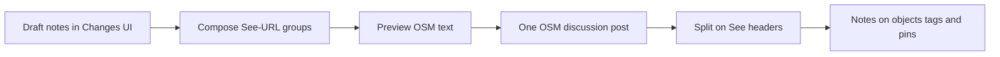
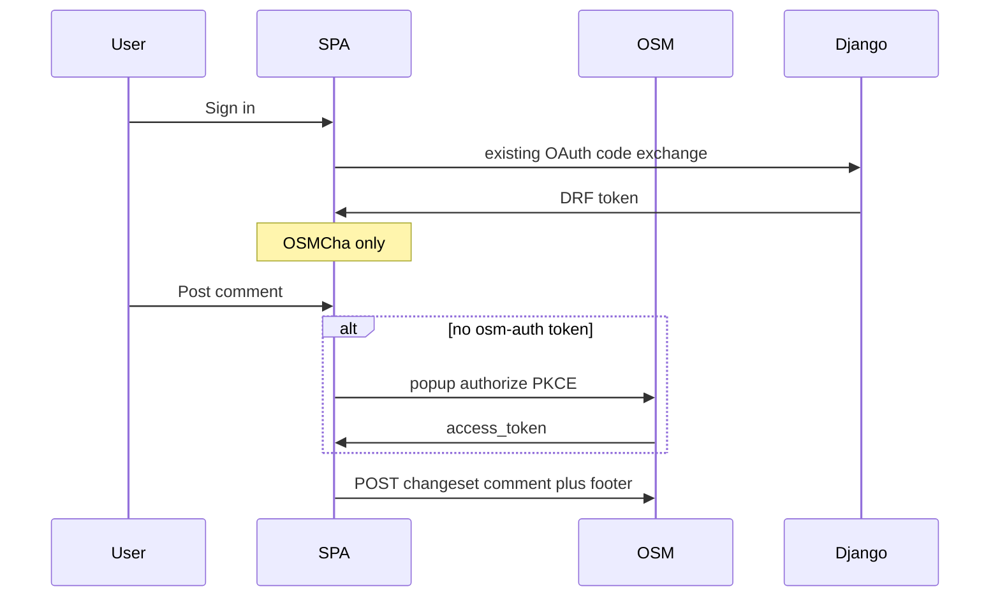
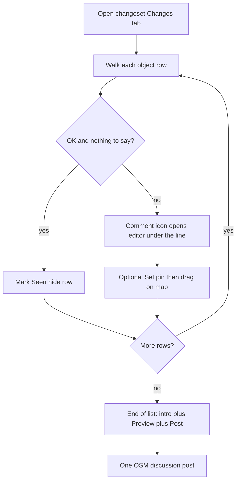
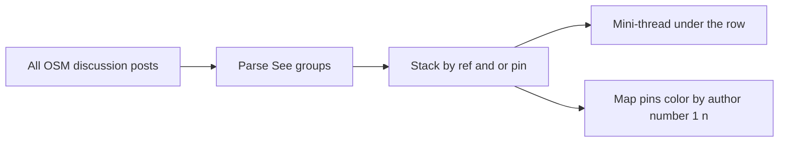

# Changeset notes via OSM deep links

OSMCha has no database for per-object discussion. The only durable write is an OSM **discussion post** (not editable). v2 already **reads** that thread from OSM. Selection is React state only.

The schema is: **a working OSMCha URL is the encoding**, and each note **group starts with that URL** so parsing is a split, not a sniff. Writes go to OSM from the SPA (osm-auth on first post); Django is unchanged.



## Domain language

Write this into [`osmcha-frontend-v2/CONTEXT.md`](osmcha-frontend-v2/CONTEXT.md) (new). Do not call everything “comment”.

- **Changeset description**: mapper’s `comment=` tag. Avoid: comment.
- **Discussion post**: one OSM changeset discussion body. Avoid: comment (alone).
- **Note**: one in-app remark with a target. Many notes plus optional intro compose into one discussion post. Avoid: annotation, comment.
- **Note target**: changeset (no `ref`), object (`ref=way/123`), or tag (`ref=way/123/highway`), each with optional **pin**.
- **Reference** (`ref`): path addressing an object or a tag on that object. Avoid: element, focus, feature.
- **Pin**: map point on a note. Avoid: PIN.

**Flag** (`reviewed_features`) stays a separate OSMCha action. A note is not a flag.

Geometry chips (Moved / Rewritten) are object notes. A “change row” is a tag mutation; an “existing tag” is an unchanged row. Both use `ref=type/id/key`. The diff tells them apart.

## One `ref` param, not `element` + `tag`

Separate `element` and `tag` is a bad fit: a tag is not optional chrome, it is a narrower address of the same thing, and `tag` without `element` is meaningless. A single path keeps one chrome key and reads like OSM:

| `ref` | Target |
|---|---|
| *(absent)* | Changeset-level note |
| `way/123` | Object |
| `way/123/highway` | Tag key `highway` on that object |
| `way/123/addr:street` | Key with a colon; remainder after `type/id/` is the key (keys may contain `/`) |

Grammar (emit and accept only this; no aliases):

```
ref = type "/" id [ "/" key ]
type = "node" | "way" | "relation"
id   = digits
key  = rest of the value after the second "/"
```

`pin=lat,lng` (5 decimals) is orthogonal:

| Note | `ref` | `pin` |
|---|---|---|
| Changeset, no pin | — | — |
| Changeset, with pin | — | yes |
| Object, no pin | `way/123` | — |
| Object, with pin | `way/123` | yes |
| Tag, no pin | `way/123/highway` | — |
| Tag, with pin | `way/123/highway` | yes |

Register `ref` and `pin` as chrome in [`searchSchemas.ts`](osmcha-frontend-v2/src/routing/searchSchemas.ts) and [`filterSearch.ts`](osmcha-frontend-v2/src/routing/filterSearch.ts). Strip them when leaving the changeset. Existing `map` stays camera-only; **do not put `map=` in posted note URLs**.

Canonical posted URL uses a configured **public origin** (not hardcoded `osmcha.org`):

```
https://<NOTE_PUBLIC_ORIGIN>/changesets/123456789?ref=way/123/highway&pin=52.52014,13.40521
```

Opening that URL selects the object, scrolls the Changes list, highlights the tag row if a key is present, shows the pin, and zooms.

## OSM.org actually renders (checked on `openstreetmap-website` `master`)

Local clone is on `master`, in sync with `origin/master`. Changeset discussion is **not Markdown**.

[`ChangesetComment#body`](https://github.com/openstreetmap/openstreetmap-website/blob/master/app/models/changeset_comment.rb) is `RichText.new("text", …)`. [`RichText::Text#to_html`](https://github.com/openstreetmap/openstreetmap-website/blob/master/lib/rich_text.rb) does:

1. HTML-escape
2. Rails `simple_format` (blank line → new `<p>`, single newline → `<br>`)
3. Rinku autolink of `http(s)` URLs
4. Shorthand expansion (`way/123` → osm.org/way/123, `highway=path` → wiki tag, `@user` → osm.org user)

Diary entries use Markdown; changeset comments do not. `**bold**` and `- lists` show as literals on osm.org.

Emoji **are allowed**: the body validator only rejects control characters; tests include `🙂`. Do not rely on emoji as the machine token (variation selectors, screen readers, mappers already use arrows).

OSMCha should still render a **small markdown subset** (bold, lists, autolink, nl2br) when displaying notes. Compose **plain text** so osm.org stays readable; markdown in a note body is optional and will look raw on osm.org.

`way/123` inside `?ref=way/123` is safe from OSM shorthand expansion: `=` is not a delimiter for those patterns.

## Frozen discussion-post layout: split on `See <url>`

Each note group **starts with** a header line, then the body. That is the easiest parser: split, then assign.

The query string is for OSMCha. Osm.org readers never decode `?ref=` / `?pin=`. The header therefore carries a **short visible label** between `See ` and the URL. Composer always emits it; the parser does **not** require it (only `See ` + our URL).

```
Optional intro (changeset-level, no header — today’s free-text discussion).

See `way/123` https://<NOTE_PUBLIC_ORIGIN>/changesets/999?ref=way/123
The classification looks wrong for this residential street.

See `way/123` > `highway` https://<NOTE_PUBLIC_ORIGIN>/changesets/999?ref=way/123/highway
This looks like a path, not residential.

See 📍 https://<NOTE_PUBLIC_ORIGIN>/changesets/999?pin=52.52014,13.40521
The crossing is missing here.

See 📍 `way/123` > `highway` https://<NOTE_PUBLIC_ORIGIN>/changesets/999?ref=way/123/highway&pin=52.52014,13.40521
Same tag, and a pin where I think it should be.
```

Frozen label (after `See `, before the URL). Inline markdown: backticks around the object and the key; `>` is the hierarchy (object → tag). OSMCha renders that subset; osm.org shows the backticks as literals, which still reads as a path.

| Note | Label |
|---|---|
| Object | `` `way/123` `` |
| Tag / change row | `` `way/123` > `highway` `` |
| Pin only | `📍` |
| Object + pin | `` 📍 `way/123` `` |
| Tag + pin | `` 📍 `way/123` > `highway` `` |

`>` sits in the middle of the line, so OSMCha will not treat it as a blockquote. 📍 only when `pin` is present, always first. No tag emoji — the keyed `` `highway` `` is the indicator.

Osm.org still autolinks `way/123` inside backticks (backtick counts as a delimiter for their shorthand). Parser tests should include this markdown label form.

Why `See ` stays the machine prefix (not 📍 alone):

- Stable ASCII, start-of-line, screen-reader friendly
- 📍 is **decoration**, not the split token (copy/paste can drop the variation selector)
- `Re:` looks like email; `Reference:` is long

Composer: `See ` + label + space + canonical URL; newline; body; blank line before the next group. Intro is everything before the first header.

### Reference footer (SPA, not Django)

Do **not** use Django’s default footer (`#REVIEWED_GOOD` / `#REVIEWED_BAD` `#OSMCHA` plus “Published using OSMCha”). That talks about evaluation; we only want a link back to this changeset.

The SPA owns the body (osm-auth POST). Rules:

- If the post already has at least one group header (`See …` + `ref` and/or `pin`), **omit** the footer — those URLs are the reference.
- If not (changeset-level prose only), append one reference line, no review hashtags:

```
See https://<NOTE_PUBLIC_ORIGIN>/changesets/{id}
```

No `ref` / `pin`, so the parser does not treat it as a note group (rule 5 below). Osm.org still autolinks it.

Django fallback (popup cancelled) still appends the old evaluation footer; prefer completing osm-auth so we keep control.

## Parser: only our schema; never crash

Do **not** sniff handwritten OSM ids (`n/123`, `way-123`, `w 123`). Those are not our schema. Foreign text must be ignored, not interpreted.

A line is a **group header** only if all of these hold:

1. Start of line is `See `
2. Same line contains an `https://` URL (optional label between `See ` and the URL)
3. Hostname is in the configured **note-link host allowlist** (see below) — not hardcoded `osmcha.org`
4. Path is `/changesets/{the changeset we have open}`
5. Query has `ref` and/or `pin`

If 1–4 fail: **not a header**, keep scanning (Django footer `Published using OSMCha: https://osmcha.org/changesets/{id}` has no `See `, no `ref`/`pin` — ignored unless that host is in the allowlist *and* the line starts with `See `).

If 1–4 hold but 5 fails (`See` + our changeset URL with neither `ref` nor `pin`): not a note group; ignore that header, do not attach.

If `ref` is present but does not match the grammar (`way-123`, `n/123`, empty): skip that group (do not attach), do not throw; the raw post still shows in Discussion.

Unknown query keys are ignored (forward compatible). Object not in this adiff: still a note (people will mention nearby objects). Same target from several posts: stack by post date. Author/time come from the OSM post.

### Host allowlist (config, not hardcoded)

The production hostname will not stay `osmcha.org`. Parser and composer share one config, e.g. in [`constants.ts`](osmcha-frontend-v2/src/config/constants.ts) or env:

- `NOTE_PUBLIC_ORIGIN` — origin we **emit** in `See` URLs and the SPA footer (never localhost in a body that might be posted to production OSM).
- `NOTE_LINK_HOSTS` — hostnames we **accept** when parsing (include current production, `www.` variant, preview/staging, and `localhost` / `127.0.0.1` for local round-trips). Compare hostname only, case-insensitive.

A `See` URL whose host is not on that list is not a group header. Wrong-changeset path is also not a header.

### Parser tests (required)

Vitest next to the parser (same pattern as [`changesetElements.test.ts`](osmcha-frontend-v2/src/components/changeset/changesetElements.test.ts)). Cover at least:

- Happy path: intro + object / tag / pin-only / tag+pin groups with markdown labels (`` `way/123` > `highway` ``); `addr:street`; extra unknown query keys.
- Labels optional: header with only `See ` + URL still parses (hand-stripped emoji).
- Allowlist: listed host parses; unknown host ignored; `www` only if listed.
- Not headers: Django evaluation footer; `See` changeset URL with neither `ref` nor `pin` (our reference footer); `See` to a different changeset id; URL not at start of line.
- Invalid `ref` (`n/123`, `way-123`, empty) skips that group, does not throw; rest of the post still parses.
- Garbage / empty / no URLs → `[]`, never throw.
- Round-trip: composer output of N notes parses back to the same targets and bodies; intro-only post gets the reference footer, grouped post does not.

Write this as [`osmcha-frontend-v2/docs/adr/0001-notes-in-osm-discussion-urls.md`](osmcha-frontend-v2/docs/adr/0001-notes-in-osm-discussion-urls.md).

## Auth: no Django changes for now

Do **not** change `/social-auth/`, the comment proxy, or the 1000-char serializer. OSMCha Sign in stays Django.

The OSM access token never comes back from Django, so a single consent cannot give the SPA both tokens. The least annoying workaround: **leave login alone, ask OSM only when posting**.

| Path | Django PR? | Extra OSM consent? |
|---|---|---|
| Keep posting through Django | No | No — but 1000-char cap and hardcoded `osmcha.org` footer |
| **Lazy osm-auth on Post** (this plan) | No | Once per browser, only when they first post a comment |
| osm-auth at Sign in + Django `do_auth(access_token)` | Yes (later) | No extra consent |

Use [osm-auth](https://www.npmjs.com/package/osm-auth) as a **second, public** OSM OAuth app (Confidential unchecked). That is an OSM.org app registration, not a Django deploy. Redirect URI must **not** be `/authorized` (Django already owns that). Use a dedicated path, e.g. `/osm-oauth`, popup mode (`singlepage: false`) so the changeset page is not left.

Flow:

1. User is already signed in to OSMCha (Django Token), as today.
2. They compose notes and click Post.
3. If osm-auth has no token: popup “Allow OSMCha to post this comment on OpenStreetMap.” Persist the token (osm-auth’s localStorage). Next posts skip the popup.
4. SPA `POST`s `text=…` to OSM `/api/0.6/changeset/{id}/comment/`. Footer: reference line only when there is no `See` group; never `#REVIEWED_*`.
5. If they cancel the popup: fall back to today’s Django `POST /changesets/{id}/comment/` (old footer, 1000-char cap) so posting still works.



Later (out of this plan): Django accepts `{ access_token }` on `/social-auth/` and Sign in can collapse to one consent. Not needed to ship notes.

Composer: count against a UI cap (e.g. 2000) on the OSM path; if falling back to Django, enforce 1000 and warn.

## Testing comments: OSM sandbox, never production

Do **not** post discussion from local/CI onto production osm.org (that would notify real mappers). OSM changeset IDs are **not** shared between production and the sandbox, so a sandbox comment cannot show up on an OSMCha production changeset. Split tests:

| Layer | Where | Posts to OSM? |
|---|---|---|
| Parser / composer | Vitest fixtures | No |
| osm-auth + `POST …/comment/` | [OSM API sandbox](https://wiki.openstreetmap.org/wiki/API_v0.6) `https://master.apis.dev.openstreetmap.org` | Yes, sandbox only |
| OSMCha UI against production changesets | Read-only (parse existing discussion) | No |

**Sandbox setup (once, not Django):**

1. Create a **separate** account at https://master.apis.dev.openstreetmap.org/ (production OSM login does not work there).
2. Register a **public** OAuth 2 app on that same site (`/oauth2/applications`): Confidential unchecked, redirect `http://127.0.0.1:<port>/osm-oauth`, scope `write_changeset_comments` (or `write_api`).
3. Point local osm-auth at sandbox: `url` + `apiUrl` = `https://master.apis.dev.openstreetmap.org` (osm-auth options). Production build keeps www/api.openstreetmap.org.
4. Pick or create a **sandbox** changeset, post a composed `See` comment, `GET …/changeset/{id}.json?include_discussion=true`, run the parser. That is the live write/read loop.

**Django stays on production OSM.** [`OSM_SERVER_URL`](osmcha-django/config/settings/common.py) (default `https://www.openstreetmap.org`) is OSMCha Sign in and the comment *fallback* proxy. Do not point Django at the sandbox: sandbox users are not OSMCha users, and OSMCha’s changeset ids are production ids. Lazy osm-auth is independent of Django, so local comment tests do not need a Django sandbox.

**CI:** parser tests only. No OSM credentials, no live POST.

**Production posting** (real OSMCha) uses the production osm-auth app and production API — only from a production (or explicitly flagged) build, never as the local default.

## UX: walk the Changes list, submit once

GitHub review model: mark files viewed to hide them; comment on a line; submit the whole review at the end. Nothing is posted to OSM until **Post**.



### 1. Open the changeset

Changes tab is the work surface (list of objects and tag diffs). Discussion tab is the raw OSM thread (read + published notes). Map shows the adiff plus **draft and published pins**.

Signed-out: can read published notes and pins; cannot draft, mark Seen, or post.

### 2. Seen (hide) — not a comment

Each **object row** (`way/123`, like a GitHub file) has a **Seen** control (checkbox, GitHub “Viewed”).

- Meaning: “I looked at this; it is OK and **not worth communicating**.”
- Effect: collapse/hide that row (and its tags). A count like “12 seen” at the list top restores them.
- **Not** sent to OSM. **Not** a flag. Local only, persisted per changeset (and user) in `localStorage` so a refresh keeps progress.
- A row with a **draft note** can still be marked Seen (hides the row; the draft stays in the submit bar). Un-seeing brings the editor back.

Seen is **object-level**, not per tag key. Commenting is available on both the object header and each tag line.

### 3. Comment on a line

On the object header and on each tag row (added / removed / changed / unchanged):

- Pointer: comment icon on **hover**.
- Touch / iPad: icon always visible, 44px target (no hover).
- Click opens an **editor directly under that line** (one open editor at a time; opening another keeps the previous draft).

Editor contents:

- Label by target, e.g. `Comment on way/123`, `Comment on tag (changed): highway`, `Comment on tag: name`.
- Textarea (the note body).
- **Set pin** button.
- Delete-draft control if they abandon the note.

Published notes from others already sit under the same line (author, time, body). Drafts are visually distinct (e.g. yellow, like GitHub pending comments).

### 4. Pin on a note

- **Set pin**: places a pin (default: current map center, or the object’s geometry if any). The button becomes a pin state with an **X** beside it (where Set pin was) to remove the pin.
- While **this** editor is open, that pin is **draggable** on the map. Closing the editor (or opening another) leaves the pin where it is; drag is only active for the focused editor.
- Removing the pin does not delete the text.

No separate map “comment mode.” The map only receives a pin from Set pin (or the global pin at submit).

### 5. Submit — end of the Changes list

Not per-row Post. One review at the **bottom of the Changes list**:

- Optional **changeset-level** textarea (intro / overall remark; today’s good/bad templates belong here).
- **Set pin** on that block = global pin (`pin` only, no `ref`). Same drag / X behavior while that block is focused.
- Count of pending notes, e.g. `3 line notes · 1 pin`.
- **Preview**: the exact OSM plaintext (all `See \`way/123\` > \`highway\` …` groups, intro, conditional reference footer, character count). This is the “whole comment with all sub-comments.”
- **Post to OSM**: osm-auth popup if needed, then one discussion post. Success: clear drafts, refetch discussion, pins become published.

A compact **sticky** “N notes · Preview & post” stays visible while scrolling the list so they do not have to hunt for the bottom. It jumps to the submit block.

Switching to Discussion does not drop drafts.

### 6. After post

Drafts become published notes on the matching object / tag; pins join the numbered pin layer; Discussion shows the new OSM post in **interpreted** form (below).

### 7. Many authors: mini-threads, numbered pins, legend

Parse **all** discussion posts. A note’s target is `ref` (object / tag) plus optional `pin`. Several people (and several posts by the same person) on the same target become one **mini-thread** under that line, oldest first — like GitHub comments on one diff line. Each entry shows author, relative time, body, and pin number if any.

Unstructured posts (no `See` groups) stay changeset-level only (Discussion tab + intro area), not attached to rows.

**Pin numbers** join map and sidebar. One sequence `1…n` for every pin on this changeset (published, then your drafts). Order: discussion chronological (oldest post first, then order inside that post), then draft pins. The same **#3** is on the map marker and next to the note in the Changes list. Click pin ↔ scroll/highlight that note; click the number in the list ↔ zoom to the pin.

**Color = author**, not pin number. Hash the OSM username onto a small fixed palette (≈8–10 distinct colors). All of Alice’s pins share Alice’s color; the number stays unique. Your drafts use your color with a dashed/hollow marker so they read as unpublished.

**Legend** inline at the top of the Changes list (and repeated in a compact form on the map control if there are pins): swatch + display name + pin count. Only authors who have at least one pin. Keep it small; it is not a second user directory.



### 8. Discussion tab: interpreted post, optional raw

Do **not** clone the Changes list. Each OSM discussion post is still one card (author, time). Default body is an **interpreted** layout that proves we parsed the groups:

- Intro prose (if any)
- One block per group: label `` `way/123` > `highway` ``, pin **#n** + author color if present, then the note body (markdown subset)
- Groups in the order they appeared in that post

A control on the card: **Interpreted | Raw**. Raw is today’s slightly formatted text (nl2br, autolink, markdown subset) of the original OSM body — including `See` lines — not a second review UI.

Posts with no parseable groups show only the formatted original (no empty interpreted shell).

## Implementation order

1. Glossary + ADR (schema freeze: `ref`, `pin`, `See` headers).
2. Lazy osm-auth on Post (popup, dedicated `/osm-oauth` redirect); conditional reference footer; Django untouched. Reading notes does not depend on this.
3. `ref` / `pin` in the URL: select, scroll, highlight, camera. Copy-link on an object / tag row.
4. Parser + unit tests; mini-threads on rows; numbered color-coded pins + legend.
5. Seen checkboxes, inline editors + pin drag, submit/preview bar at end of Changes list.
6. Sandbox osm-auth smoke: post+fetch on `master.apis.dev.openstreetmap.org`, never production.
7. Discussion tab: interpreted groups per post, toggle to raw.

No OSMCha storage for notes. No Django PR. Later, Django `do_auth(access_token)` can collapse Sign in to one consent.
