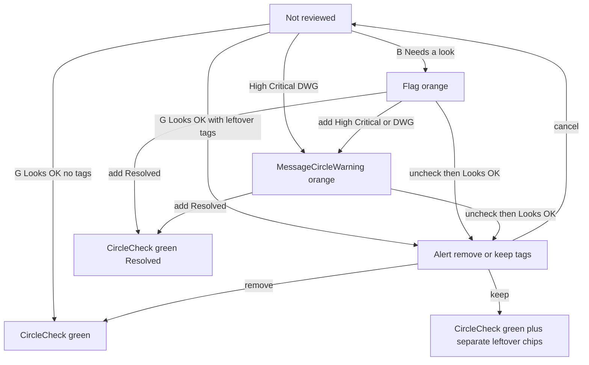

# Review

How OSMCha v2 presents changeset reviews: **Looks OK** vs **Needs a look**, and how tags enhance that binary state.

Canonical code: [`src/components/changeset/reviewPresentation.ts`](../src/components/changeset/reviewPresentation.ts). **Update this page when that file, the review buttons, leftover-tag Alert, or tag exclusivity changes.**

The API still stores `harmful` true/false (`set-good` / `set-harmful`). Tag names stay as returned by `/tags/`.

---

## Verdicts

| UI               | API                             | Meaning                                                                                     |
| ---------------- | ------------------------------- | ------------------------------------------------------------------------------------------- |
| **Looks OK**     | `set-good` (`harmful: false`)   | Nothing stood out; I think this is OK. Keyboard **G**.                                      |
| **Needs a look** | `set-harmful` (`harmful: true`) | Something is worth checking, discussing, reverting, or working on. Keyboard **B** (no tag). |
| Clear            | `uncheck`                       | Remove the review. Does **not** clear tags in Django.                                       |

Icons: CircleCheck (Looks OK / Resolved), Flag (soft not-OK), MessageCircleWarning (High / Critical / DWG).

---

## Tag groups

At most one tag per exclusive group (UI replaces siblings):

| Group      | Tags                                              |
| ---------- | ------------------------------------------------- |
| Intent     | Unintentional, Intentional                        |
| Severity   | Severity: Low, Severity: High, Severity: Critical |
| Follow-up  | Unresolved, Resolved                              |
| Escalation | DWG (on/off)                                      |

You may combine across groups (e.g. Unintentional + Low + Unresolved).

---

## Icon / color precedence

First match wins:

1. Not reviewed → no review icon
2. Looks OK → CircleCheck, green (leftover tags listed separately)
3. Needs a look **and Resolved** → CircleCheck, green
4. Needs a look **and** (Severity High **or** Critical **or** DWG) → MessageCircleWarning, orange
5. Else Needs a look → Flag, orange

---

## Name, tooltip, icon per state + tag

| Combo                 | Name               | Tooltip                                             | Icon                 |
| --------------------- | ------------------ | --------------------------------------------------- | -------------------- |
| Looks OK              | Looks OK           | Nothing stood out; I think this is OK.              | CircleCheck          |
| Needs a look (no tag) | Needs a look       | Something here is worth checking or discussing.     | Flag                 |
| + Unintentional       | Unintentional      | Looks like a mistake, not deliberate.               | Flag                 |
| + Intentional         | Intentional        | Looks deliberate.                                   | Flag                 |
| + Severity: Low       | Severity: Low      | Minor issues; still worth a look.                   | Flag                 |
| + Severity: High      | Severity: High     | Serious issues; discuss, revert, or fix.            | MessageCircleWarning |
| + Severity: Critical  | Severity: Critical | Critical damage to the map; needs urgent attention. | MessageCircleWarning |
| + Unresolved          | Unresolved         | Still needs discussion, revert, or work.            | Flag\*               |
| + Resolved            | Resolved           | The issues were addressed.                          | CircleCheck          |
| + DWG                 | DWG                | Report this to the Data Working Group.              | MessageCircleWarning |

\*Unless High / Critical / DWG is also set.

Stacked tags: badge follows precedence; tooltip lists the reviewer and tag names.

---

## Leftover tags on Looks OK

Uncheck does not clear tags. Choosing **Looks OK** while tags remain opens an Alert:

- **Remove tags and mark Looks OK** — `set-good` with `{ tags: [] }`
- **Keep tags** — `set-good` without clearing; leftover chips stay in a separate zinc cluster
- **Cancel** — no change

Leftover chips are not part of the Looks OK verdict icon.

---

## Flow

